# Paths Package Diagram

Source: [`paths/paths.go`](./paths.go)

## Path Graph

```mermaid
flowchart TD
  A["Base()"] --> B{"dataDir sudah di-set?"}
  B -- "ya (SetDataDir)" --> C["pakai dataDir custom"]
  B -- "tidak" --> D{"IsPackaged()?"}
  D -- "ya" --> E["UserDataDir()"]
  D -- "tidak" --> F["data"]
  E --> G["mkdir -p dataDir"]
  F --> G
  C --> G

  G --> DB["Database(): {Base}/veridium.db"]
  G --> DDB["DuckDB(): {Base}/duckdb.db"]
  G --> KBA["KBAssets(): {Base}/kb-assets"]
  G --> FILES["FileBase(): {Base}/files"]
  G --> LOG["ContributorLog(): {Base}/logs/contributor.log"]

  G --> J["Jarvis(): {Base}/jarvis"]
  J --> JK["JarvisKeystores(): {Jarvis}/keystores"]
  J --> JN["JarvisNetworks(): {Jarvis}/networks"]
  J --> JADB["JarvisAddressBookDB(): {Jarvis}/addressbook.duckdb"]
  J --> JAH["JarvisAddressBookHash(): {Jarvis}/addressbook.hash"]
  J --> JC["JarvisCache(): {Jarvis}/cache.json"]
  J --> JAB["JarvisAddressBook(): {Jarvis}/addresses.json"]
  J --> JS["JarvisSecrets(): {Jarvis}/secrets.json"]

  G --> M["Models(): {Base}/models"]
  M --> MP["ModelPath(url): {Models}/{author}/{repo}"]
  M --> WM["WhisperModels(): {Models}/whisper"]

  G --> L["Libraries(): {Base}/libraries"]
  L --> SDL["StableDiffusionLib(): {Libraries}/stablediffusion"]
  L --> SDB["StableDiffusionBin(): {Libraries}/stable-diffusion/bin"]
  L --> SDC["StableDiffusionChecksums(): {Libraries}/stable-diffusion/checksums"]
  L --> SDM["StableDiffusionMetadata(): {Libraries}/stable-diffusion/metadata"]
  L --> WL["WhisperLib(): {Libraries}/whisper"]
  L --> TTS["TTSLib(): {Libraries}/tts"]

  G --> CAT["Catalogs(): {Base}/catalogs"]
  G --> TMP["Templates(): {Base}/templates"]
  G --> SDO["StableDiffusionOutputs(): {Base}/files/stable-diffusion"]

  G --> N1["Node() (deprecated): Base()"]
  M --> N2["NodeModels() (deprecated): Models()"]
  L --> N3["NodeLibraries() (deprecated): Libraries()"]
  CAT --> N4["NodeCatalogs() (deprecated): Catalogs()"]
  TMP --> N5["NodeTemplates() (deprecated): Templates()"]
```



## Folder Tree

```text
{Base}/
├── veridium.db
├── duckdb.db
├── kb-assets/
├── files/
│   └── stable-diffusion/
├── logs/
│   └── contributor.log
├── jarvis/
│   ├── keystores/
│   ├── networks/
│   ├── addressbook.duckdb
│   ├── addressbook.hash
│   ├── cache.json
│   ├── addresses.json
│   └── secrets.json
├── models/
│   ├── whisper/
│   └── {author}/
│       └── {repo}/
├── libraries/
│   ├── stablediffusion/
│   ├── stable-diffusion/
│   │   ├── bin/
│   │   ├── checksums/
│   │   └── metadata/
│   ├── whisper/
│   └── tts/
├── catalogs/
└── templates/
```
